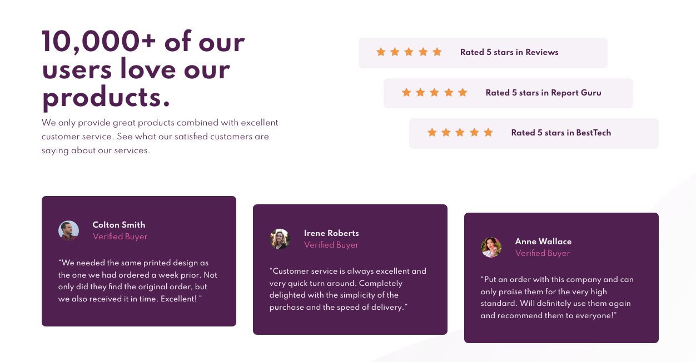
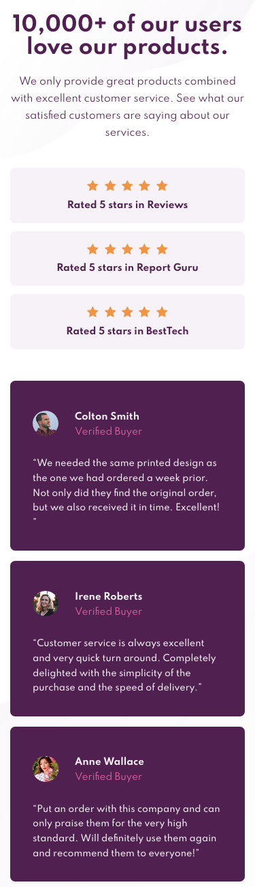

# Frontend Mentor - Social proof section solution

This is a solution to the [Social proof section challenge on Frontend Mentor](https://www.frontendmentor.io/challenges/social-proof-section-6e0qTv_bA). Frontend Mentor challenges help you improve your coding skills by building realistic projects.

## Overview

### The challenge

Users should be able to:

- View the optimal layout for the section depending on their device's screen size

### Screenshot

### Links

- [Solution](https://www.frontendmentor.io/solutions/social-proof-section-with-scss-and-flexbox-XtlA8kxUz)
- [Live Site](https://filippo-b.github.io/social-proof-section/)

## My process

### Built with

- Semantic HTML5 markup
- Flexbox
- SCSS
- Mobile-first workflow

### What I learned

This was great to practice flexbox.

### Continued development

### Useful resources

- [CSS Tricks Flexbox guide](https://css-tricks.com/snippets/css/a-guide-to-flexbox/)
- [CSS Flexbox course](https://www.youtube.com/watch?v=-Wlt8NRtOpo&t=2237s) by freeCodeCamp.

## Author

- Frontend Mentor - [@Filippo-b](https://www.frontendmentor.io/profile/Filippo-b)
